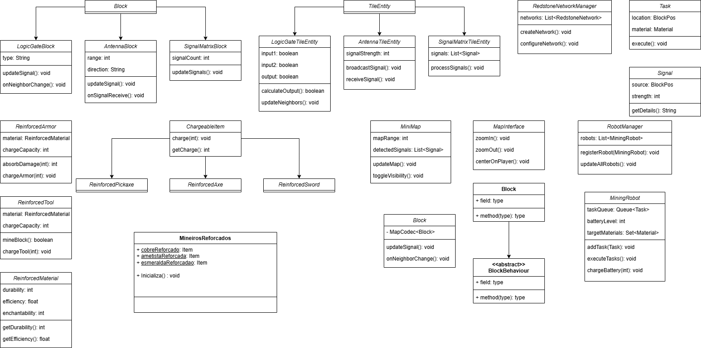

## Introdução 
<!--  
- **Apresente o tema do projeto ou estudo;**
- **Busque trazer referências no decorrer do texto;**
- Destaque a relevância do diagrama ou abordagem para a área de aplicação.
- Mencione brevemente os principais aspectos que serão abordados no documento.
-->

O uso de diagramas de classes é fundamental em engenharia de software, pois promove clareza na modelagem do sistema, garantindo rastreabilidade e organização dos requisitos. Ao ilustrar a estrutura de classes, destacam-se relações, atributos e métodos que permitem maior entendimento da arquitetura proposta, favorecendo a implementação colaborativa e eficiente.

## Objetivo
<!--  
- **Declare o que se pretende alcançar com o diagrama em projetos no geral; Busque referenciar!**
- **Declare o que se pretende alcançar com o diagrama para equipe neste contexto;**
- **Destaque os resultados esperados, como soluções para problemas, melhorias no entendimento ou suporte à tomada de decisões.**
-->

O diagrama de classes visa facilitar a compreensão e implementação das funcionalidades do mod, oferecendo uma visão estruturada dos blocos, itens e sistemas introduzidos. Para a equipe, o objetivo é mitigar ambiguidades durante o desenvolvimento, evidenciar dependências entre classes e suportar a expansão futura do sistema. Especificamente neste contexto, espera-se que o diagrama funcione como uma referência centralizada para a modelagem do código, promovendo padronização e integração das novas funcionalidades ao código original do jogo.

## Metodologia
<!--  
- **Explique o processo utilizado para desenvolver o trabalho. COMO foi feito?**
- **Descreva as ferramentas, técnicas ou referências utilizadas na construção do diagrama ou solução. Se houver alguma ferramenta específica determinada pela professora, a sugestão é usá-la sendo em qualquer etapa do processo. Podem começar com uma ferramenta que já são familiarizados e depois explorar outras ferramentas.**
- Se desejarem, podem citar os desafios encontrados seguindo a metodologia, propostas de melhoria, etc.
-->

A construção do diagrama seguiu os princípios de orientação a objetos, alinhando-se à arquitetura do Minecraft. A base foi estruturada considerando as classes principais do jogo original, que foram estendidas para incluir novos comportamentos. Ferramentas de modelagem UML foram utilizadas para criar o diagrama, permitindo representação visual das relações, como heranças e associações. O processo foi iterativo, revisando e validando os requisitos junto à equipe, e ajustando a modelagem para garantir consistência com os objetivos do projeto.

## Resultados
<!--  
- **Apresente o produto final, como o diagrama ou solução desenvolvida.** 
- **Desenvolva ao menos um parágrafo referenciando a figura**
- **Adicione "Figura 1 - Título da Figura/Quadro/Tabela" acima e "Fonte: " abaixo dela**
- Destaque os pontos principais ou insights obtidos durante o processo.
- **APRESENTE AS VERSÕES DO DIAGRAMA!! Podem usar o formato abaixo para poluir menos a página**
-->

O diagrama final inclui classes que implementam portas lógicas no sistema de redstone, que descrevem novos materiais reforçados, que automatizam tarefas de mineração. As classes de novos itens, como ferramentas e armaduras reforçadas, estão integradas com uma interface que centraliza funcionalidades de carga. Além disso, o minimapa interage com classes de sinal para fornecer detecção em tempo real de atividades redstone. Essa modelagem permite escalabilidade e flexibilidade para futuras iterações

### Versões Anteriores

Visualizar versão 1.2

### Versão 1.2
<!-- Alterar para o Diagrama de Classes>
<!-- Aqui documente as mudanças de uma versão para a outra -->
A Figura 1 apresenta não só o BPMN revisado como também alguns materiais utilizados durante sua confecção.

<b>Figura 1 -</b> BPMN revisado versão 1.2

<b>Fonte:</b> Lemos, 2024.

Visualizar versão 1.1

### Versão 1.1

A Figura 2 apresenta não só o BPMN revisado como também alguns materiais utilizados durante sua confecção.

<b>Figura 2 -</b> BPMN revisado versão 1.1

<b>Fonte:</b> Silva, Lemos, Sandes, Carvalho, 2024.

Visualizar versão 1.0

### Versão 1.0

Primeiro rascunho do Diagrama de Classes pode ser vista na Figura 3.

<b>Figura 3 -</b> Diagrama de Classes versão 1.0

<b>Fonte:</b> Silva, Bartz, Sandes, Lemos,  Carvalho, Santos, Alves, 2024.

## Conclusão
<!--  
-   **Resuma os pontos principais do trabalho.**
-   **Avalie se os objetivos foram alcançados e o impacto do trabalho.**
-   **Apresente perspectivas para melhorias ou trabalhos futuros.**
-->

O diagrama de classes atinge o objetivo de estruturar os requisitos do mod, promovendo clareza e integração com o código original do Minecraft. Ele é essencial para alinhar a visão da equipe, identificando dependências e promovendo a modularidade do sistema. Melhorias podem ser feitas para garantir maior consistência durante as implementações subsequentes.

## Bibliografia 

 [1] SERRANO, Milene. Videoaula: [05b - VideoAula - DSW - Modelagem - Diagrama de Classe](https://unbbr-my.sharepoint.com/personal/mileneserrano_unb_br/_layouts/15/stream.aspx?id=%2Fpersonal%2Fmileneserrano%5Funb%5Fbr%2FDocuments%2FArqDSW%20%2D%20V%C3%ADdeosOriginais%2F05b%20%2D%20VideoAula%20%2D%20DSW%2DModelagem%20%2D%20Diagrama%20de%20Classe%2Emp4&ga=1&referrer=StreamWebApp%2EWeb&referrerScenario=AddressBarCopied%2Eview%2E067ed549%2Db0c4%2D421f%2D9ac1%2D931759c0b4a9). [Online]. Disponível em: [https://unbbr-my.sharepoint.com/personal/mileneserrano_unb_br/_layouts/15/stream.aspx?id=%2Fpersonal%2Fmileneserrano%5Funb%5Fbr%2FDocuments%2FArqDSW%20%2D%20V%C3%ADdeosOriginais%2F05b%20%2D%20VideoAula%20%2D%20DSW%2DModelagem%20%2D%20Diagrama%20de%20Classe%2Emp4&ga=1&referrer=StreamWebApp%2EWeb&referrerScenario=AddressBarCopied%2Eview%2E067ed549%2Db0c4%2D421f%2D9ac1%2D931759c0b4a9](https://unbbr-my.sharepoint.com/personal/mileneserrano_unb_br/_layouts/15/stream.aspx?id=%2Fpersonal%2Fmileneserrano%5Funb%5Fbr%2FDocuments%2FArqDSW%20%2D%20V%C3%ADdeosOriginais%2F05b%20%2D%20VideoAula%20%2D%20DSW%2DModelagem%20%2D%20Diagrama%20de%20Classe%2Emp4&ga=1&referrer=StreamWebApp%2EWeb&referrerScenario=AddressBarCopied%2Eview%2E067ed549%2Db0c4%2D421f%2D9ac1%2D931759c0b4a9) . Acesso em: 21 nov. 2024.

## Participantes

<!-- de preferência: em ordem alfabética, seguindo o exemplo: -->

| Matrícula | Aluno                                 | Git                                                           |
| --------- | ------------------------------------- | ------------------------------------------------------------- |
| 221007813 | André Emanuel Bispo da Silva          | [Hunter104](https://github.com/Hunter104)                     |
| 221007869 | Artur Henrique Holz Bartz             | [H0lzz](https://github.com/H0lzz)                             |
| 221008024 | Eduardo Matheus dos Santos Sandes     | [DiceRunner714](https://github.com/DiceRunner714)             |
| 170010872 | Gabriela de Oliveira Lemos            | [heylisten64](https://github.com/heylisten64)                 |
| 221008150 | João Antonio Ginuino Carvalho         | [joaoseisei](https://github.com/joaoseisei)                   |
| 221008445 | Samara Letícia Alves dos Santos       | [samarawwleticia](https://github.com/samarawwleticia)         |
| 211062526 | Thomas Queiroz Souza Alves            | [thmasq](https://github.com/thmasq)                           |

---

## Histórico de Versão

| Versão | Data da alteração |            Alteração            |                  Responsável                  |                      Revisor                       | Data de revisão |
| :----: | :---------------: | :-----------------------------: | :-------------------------------------------: | :------------------------------------------------: | :-------------: |
|  1.0   |       21/11       |      Criação do documento       | [H0lzz](https://github.com/H0lzz)             |                                                    |                 |
|  2.0   |       23/11       |      Adição da Primeira versão do Diagrama de Classes       | [Hunter104](https://github.com/Hunter104), [H0lzz](https://github.com/H0lzz), [DiceRunner714](https://github.com/DiceRunner714), [heylisten64](https://github.com/heylisten64), [joaoseisei](https://github.com/joaoseisei), [samarawwleticia](https://github.com/samarawwleticia), [thmasq](https://github.com/thmasq).             |                                                    |                 |

## Controle de Revisão

|                        Revisor(es)                        |                                             O que foi realizado                                             |
|:---------------------------------------------------------:|:-----------------------------------------------------------------------------------------------------------:|
|                                                           |                                                                                                             |